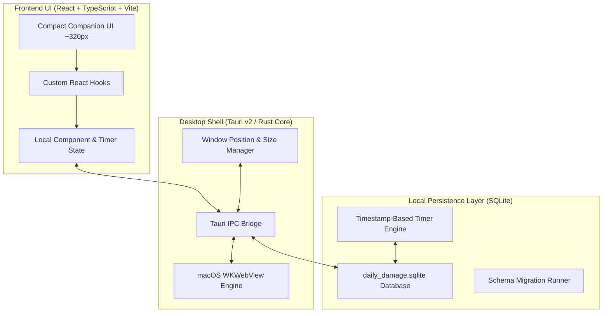

# Technical Architecture & Engineering Decisions

> **Status:** DECIDED & FROZEN (Prompt 1)  
> **Application:** Daily Damage  
> **Architecture:** Tauri v2 + React (TypeScript) + Vite + SQLite (`tauri-plugin-sql`)

---

## 1. Architecture Evaluation & Comparison

We evaluated four major desktop architecture options against the core requirements of Daily Damage:

| Criteria | **Option 1: Tauri v2 + React** *(Selected)* | **Option 2: Electron + React** | **Option 3: Pure SwiftUI** | **Option 4: Flutter Desktop** |
| :--- | :--- | :--- | :--- | :--- |
| **Idle Memory Footprint** | 🟢 **~30 – 50 MB** | 🔴 ~200 – 350 MB | 🟢 ~15 – 30 MB | 🟡 ~70 – 120 MB |
| **Bundle Size (.app)** | 🟢 **~15 – 25 MB** | 🔴 ~100 – 150 MB | 🟢 ~5 – 15 MB | 🟡 ~40 – 70 MB |
| **Production Server Dependency** | 🟢 **None (Embedded Static Assets)** | 🟢 None (Embedded) | 🟢 None (Native) | 🟢 None (Native Engine) |
| **UI Development Velocity (LLM Pair)** | 🟢 **Fastest (React + Web Tech)** | 🟢 Fast (React) | 🟡 Slower (SwiftUI DSL) | 🟡 Moderate (Dart UI) |
| **Custom Compact Companion Styling** | 🟢 **Full CSS/Glassmorphism Control** | 🟢 Full CSS Control | 🟡 Strict Native Controls | 🟡 Canvas/Skia Rendering |
| **Local SQLite Persistence** | 🟢 **Native Rust SQLite Plugin** | 🟢 Node `better-sqlite3` | 🟢 SwiftData / GRDB | 🟢 `sqflite_common_ffi` |
| **macOS Native Packaging** | 🟢 **Built-in `tauri build` (`.dmg`/`.app`)** | 🟢 `electron-builder` | 🟢 Xcode Archive | 🟡 `flutter build macos` |

### Why Tauri v2 Was Selected
1. **Lightweight Desktop Companion:** Daily Damage lives continuously on the desktop alongside other applications. Electron's ~200MB+ memory footprint is unacceptable for a simple companion app. Tauri v2 utilizes the native macOS WKWebView engine, achieving an idle RAM usage of ~30–50 MB.
2. **Zero Runtime Server:** `tauri build` compiles the web assets directly into the native Rust executable bundle. Opening `Daily Damage.app` launches a self-contained macOS binary without spawning Node processes or exposing localhost HTTP servers.
3. **Rapid UI & Visual Polish:** React with custom CSS enables hyper-fine-tuned dark themes, custom micro-animations, compact layout density (~320px width), and rapid pair-programming iteration with Antigravity IDE and Codex.
4. **Reliable Local SQLite Engine:** Rust handles SQLite storage securely, ensuring instant writes and restart safety.

---

## 2. System Architecture Layers



---

## 3. Storage Model & Schema Design

All data is stored locally in SQLite at:  
`~/Library/Application Support/com.daily-damage.app/daily_damage.sqlite`

### Core Database Schemas

#### 1. `days` Table
Tracks daily records and final aggregate Damage metrics.
```sql
CREATE TABLE IF NOT EXISTS days (
    id TEXT PRIMARY KEY,             -- Date string 'YYYY-MM-DD'
    created_at TIMESTAMP DEFAULT CURRENT_TIMESTAMP,
    updated_at TIMESTAMP DEFAULT CURRENT_TIMESTAMP,
    damage_percentage INTEGER DEFAULT 0, -- 0 to 100
    damage_level TEXT DEFAULT 'L1',      -- 'L1', 'L2', 'L3', 'L4', 'L5'
    notes TEXT                           -- Optional daily reflection
);
```

#### 2. `routine_logs` Table
Tracks individual progress for non-study trackers.
```sql
CREATE TABLE IF NOT EXISTS routine_logs (
    id TEXT PRIMARY KEY,
    day_id TEXT NOT NULL REFERENCES days(id) ON DELETE CASCADE,
    tracker_type TEXT NOT NULL,         -- 'training', 'namaz', 'steps', 'soya', 'diet', 'sleep', 'freetime'
    item_key TEXT NOT NULL,             -- e.g., 'namaz_1', 'soya_2', 'night_sleep', 'total_steps'
    value_numeric REAL DEFAULT 0,       -- Numeric values (e.g. 12000 steps, 90 mins)
    value_boolean INTEGER DEFAULT 0,    -- 0 or 1 for completions
    updated_at TIMESTAMP DEFAULT CURRENT_TIMESTAMP,
    UNIQUE(day_id, tracker_type, item_key)
);
```

#### 3. `study_blocks` Table
Specialized table handling the 4 mandatory study blocks and timestamp persistence.
```sql
CREATE TABLE IF NOT EXISTS study_blocks (
    id TEXT PRIMARY KEY,
    day_id TEXT NOT NULL REFERENCES days(id) ON DELETE CASCADE,
    block_number INTEGER NOT NULL CHECK(block_number BETWEEN 1 AND 4),
    target_duration_seconds INTEGER NOT NULL, -- e.g., 9000s (2h30m), 7200s (2h00m), 6300s (1h45m), 4500s (1h15m)
    status TEXT NOT NULL DEFAULT 'pending',   -- 'pending', 'active', 'completed', 'abandoned'
    started_at TIMESTAMP,                    -- ISO 8601 string when block was started
    completed_at TIMESTAMP,                  -- ISO 8601 string when block reached 100%
    abandoned_at TIMESTAMP,                  -- ISO 8601 string if abandoned
    UNIQUE(day_id, block_number)
);
```

---

## 4. Mandatory Study Timer Restart-Safety Architecture

To meet the requirement that active study blocks **survive app closes, crashes, and system restarts**, the timer engine relies strictly on **persisted timestamps** rather than in-memory tick counters:

### Execution Flow:
1. **Start Study Block:**
   - App updates `study_blocks` in SQLite: `status = 'active'`, `started_at = UTC_NOW()`.
2. **Active State Display:**
   - UI polls local system clock (`now`) and computes:  
     $$\text{elapsed\_seconds} = \text{now} - \text{started\_at}$$
     $$\text{remaining\_seconds} = \max(0, \text{target\_duration\_seconds} - \text{elapsed\_seconds})$$
3. **App Restart / Crash Recovery Sequence:**
   - On application startup, the SQLite database is queried for `status = 'active'`.
   - If an active block exists:
     - The app recalculates elapsed time immediately: $\text{elapsed} = \text{now} - \text{started\_at}$.
     - If $\text{elapsed} \ge \text{target\_duration\_seconds}$, the block automatically updates to `status = 'completed'` and logs full completion duration toward today's study target.
     - If $\text{elapsed} < \text{target\_duration\_seconds}$, the block UI restores to **`DAMAGE IN PROGRESS`** seamlessly.
   - **Result:** Quitting or closing the app cannot escape an active study block.

---

## 5. Windowing & Desktop Behavior

- **Compact Layout Constraints:**
  - Standard Window Dimensions: `width: 320px`, `height: 700px`.
  - Min/Max Width: Fixed between `300px` and `340px` in compact mode.
  - Resizable Height: `600px` to `800px`.
- **Position Persistence:**
  - Tauri window event hooks listen for window move events and store window coordinates `(x, y)` in SQLite or local application config (`app_settings`).
  - Upon next launch, the window restores to its exact coordinates on the left side of the screen.

---

## 6. macOS Packaging Strategy

- **Build Pipeline:** `tauri build --target aarch64-apple-darwin`
- **Output:**
  - Executable Bundle: `Daily Damage.app`
  - Installer Disk Image: `Daily Damage_x.x.x_aarch64.dmg`
- **Self-Contained Operating Requirement:**
  - Static HTML/JS/CSS assets are compiled into the binary payload.
  - Zero external Node.js, Python, or Web server dependencies required at runtime.
