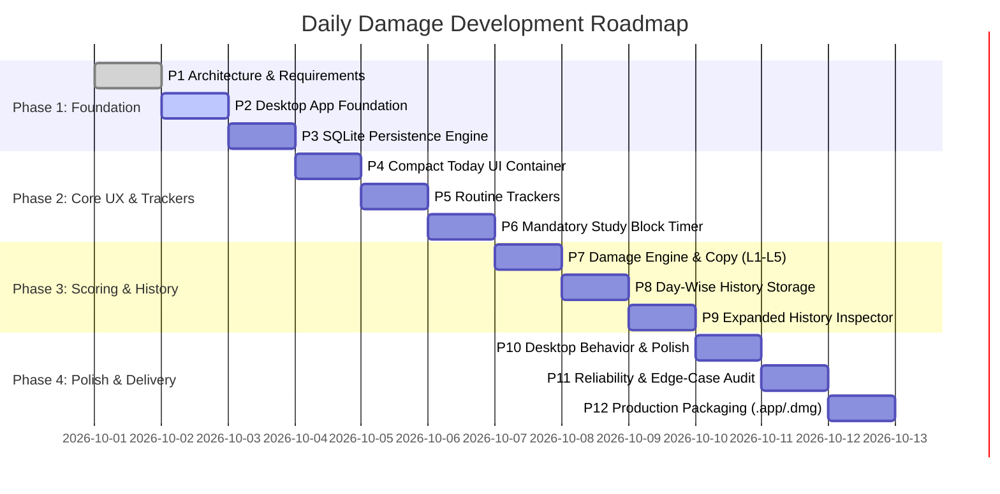

# Incremental Build Roadmap

> **Status:** ACTIVE  
> **Application:** Daily Damage  
> **Execution Strategy:** Strict phase-by-phase incremental implementation.

---

## 🗺 Overview of Phases

---

## 📋 Detailed Phase Breakdown

### Phase 1: Foundation & Infrastructure
- [x] **P1 — Repository Audit, Requirements Freeze & Architecture Decision**
  - Complete repository inspection.
  - Freeze product requirements, daily routine, tracker definitions, and 5 canonical Damage levels.
  - Evaluate technical options and select **Tauri v2 + React + Vite + SQLite**.
  - Document decisions in `docs/` and set up clean repo foundation.

- [x] **P2 — Desktop Application Foundation** *(Completed)*
  - Initialize Tauri v2 + React (TypeScript) + Vite project structure.
  - Configure native macOS window bounds (`width: 320px`, `height: 700px`, frameless styling).
  - Implement core visual theme system (dark charcoal palette, typography, micro-spacing).
  - Verify local dev build running natively via Tauri.
  - Verify production packaging producing standalone `Daily Damage.app` and `.dmg`.

- [ ] **P3 — Local Data Model & SQLite Persistence Engine**
  - Integrate SQLite plugin (`tauri-plugin-sql`).
  - Implement schema migrations for `days`, `routine_logs`, `study_blocks`, and `app_settings`.
  - Build data repository methods for day fetching, tracker updates, and record creation.
  - Ensure safe database initialization on macOS application launch.

---

### Phase 2: Core UX & Daily Routine Trackers
- [ ] **P4 — Compact Today UI & Core Container**
  - Build main compact companion container (~320px width).
  - Create header component with current date, quick status, and view toggles.
  - Build scrollable main tracker stack layout optimized for desktop companion view.

- [ ] **P5 — Routine Trackers Implementation**
  - Implement Training tracker (90 min goal, status/duration).
  - Implement Namaz tracker (5 individual daily prayer checkboxes).
  - Implement Steps tracker (12,000 steps numerical progress input/display).
  - Implement Soya tracker (Soya #1 & Soya #2 completion status).
  - Implement Diet tracker (adherence status).
  - Implement Sleep tracker (Night sleep & Nap duration).
  - Implement Free Time tracker (~2 hours positive recovery logging).

- [ ] **P6 — Mandatory Study Block Timer Engine**
  - Implement 4 predefined study blocks: Block 1 (2h30), Block 2 (2h00), Block 3 (1h45), Block 4 (1h15).
  - Build active block view (`DAMAGE IN PROGRESS`, elapsed & remaining timers).
  - Enforce single active block rule and hide standard "Stop" buttons.
  - Implement timestamp-based persistence (`started_at`, `target_duration_seconds`) in SQLite.
  - Build restart & crash recovery logic: reopening app recalculates elapsed duration seamlessly.
  - Build Emergency Abandon Modal (`•••` → confirmation → abandon without completion credit).

---

### Phase 3: Scoring, Damage Engine & History
- [ ] **P7 — Damage Calculation Engine & Canonical Level Mapping**
  - Design & implement weighted scoring formula across all 8 tracking areas.
  - Map aggregate score (0–100%) to the 5 canonical Damage Levels:
    - **L1 (0–20%):** *"Chalo, shuru toh karey."*
    - **L2 (21–40%):** *"Nai hora bhai."*
    - **L3 (41–60%):** *"Cooked hai maslaa."*
    - **L4 (61–80%):** *"Say Wallahi bro."*
    - **L5 (81–100%):** *"Same"*
  - Render prominent Damage indicator card with real-time score updates.

- [ ] **P8 — Day-Wise History Engine & Storage**
  - Implement automatic day-boundary transition (midnight rollover).
  - Save historical day snapshots to SQLite.
  - Enforce explicit distinction between `No Record` (untracked days) and `L1` (low completion).

- [ ] **P9 — Expanded View & Historical Inspection**
  - Implement expanded window view mode or drawer for viewing history.
  - Build calendar grid / day list view showing historical Damage levels (e.g. Mon L4 78%, Tue L5 91%).
  - Allow detail inspection of past days' logged tracker values.

---

### Phase 4: Polish, Reliability & Production Packaging
- [ ] **P10 — Desktop Behavior & Visual Polish**
  - Implement window position memory across launches (storing `x, y` desktop coordinates).
  - Refine dark UI visual polish, subtle micro-animations, custom scrollbars, and keyboard shortcuts.
  - Verify compact companion window ergonomics on macOS screen left boundary.

- [ ] **P11 — Reliability, Restart-Safety & Edge-Case Audit**
  - Perform edge-case testing: app termination while timer runs, date changes while app is open, system sleep/wake recovery.
  - Validate database migration safety and fallback mechanisms.

- [ ] **P12 — Production Packaging & Final QA**
  - Execute production build via `tauri build`.
  - Generate standalone macOS Apple Silicon `.app` bundle and `.dmg` installer.
  - Perform clean-environment manual verification: double-click launch, offline execution, zero terminal dependency.
